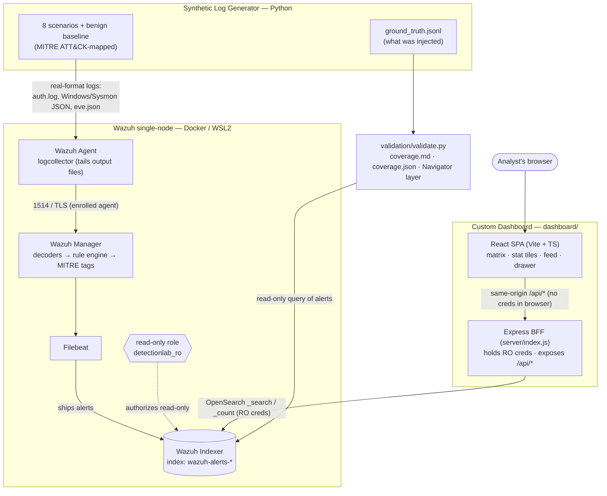
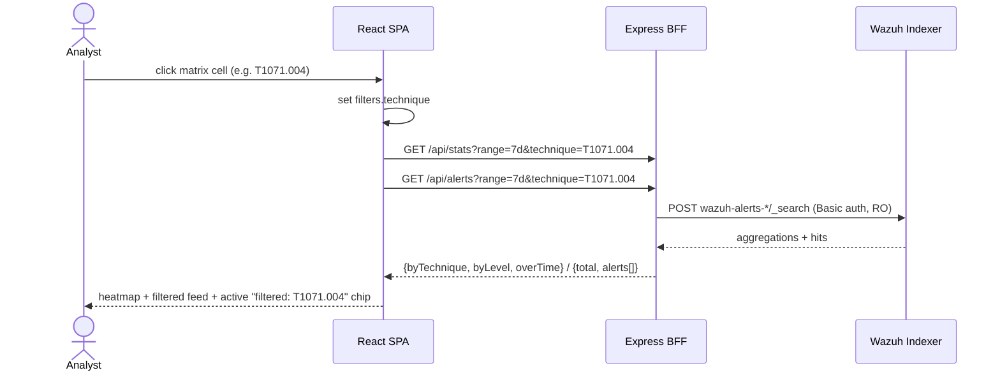
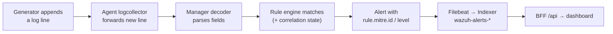
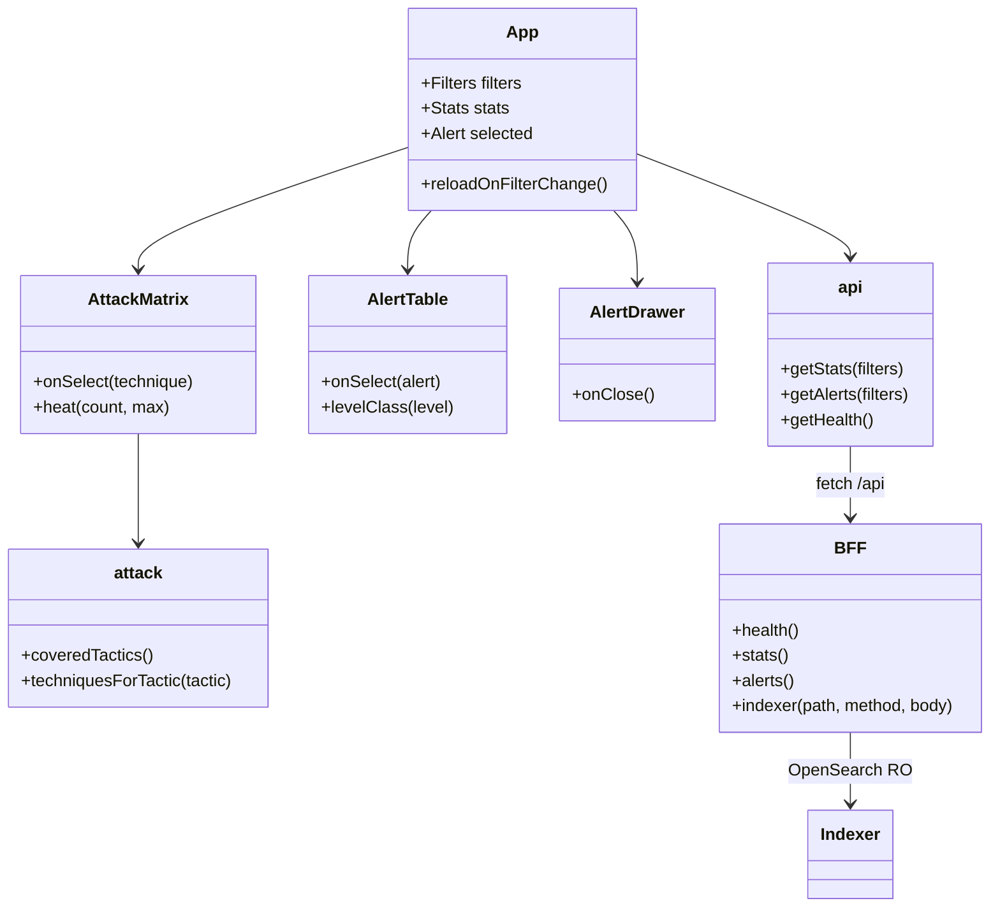

# Architecture diagram

How the components connect, end to end: the synthetic generator produces logs → Wazuh
ingests, decodes, and detects → the read-only BFF queries the indexer → the React SPA
renders. (Prose version with design rationale is in [architecture.md](architecture.md).)

## System architecture (component diagram)

Legend: `[( )]` = data store, `{{ }}` = access-control role, `([ ])` = external actor.

## Runtime data flow (analyst filters by technique)

## Ingestion path (how an injected attack becomes an alert)

## Dashboard internal structure (frontend + BFF)

## Why this shape

| Decision | Reason |
|----------|--------|
| Real log formats out of the generator | Wazuh's built-in decoders parse them; custom work stays at the detection layer |
| BFF between browser and indexer | Browser can't hold indexer creds; also solves CORS + the self-signed cert |
| Read-only account (`detectionlab_ro`) | Least privilege — dashboard can read `wazuh-alerts-*`, nothing else (verified 403 on writes) |
| `ground_truth.jsonl` + `validate.py` | Closes the loop: measured detection coverage, not just "rules exist" |
