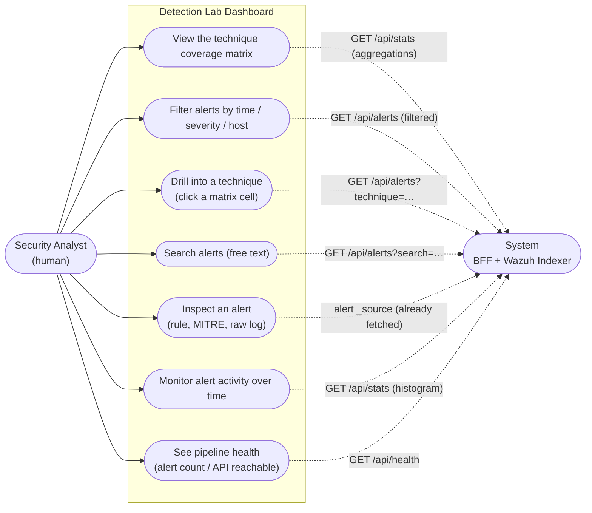

# Use case diagram — Detection Lab dashboard

Actors and the things they do with the custom ATT&CK dashboard. The **Security Analyst**
is the primary (human) actor; **System** is the backend that serves the data (the Express
BFF reading the Wazuh Indexer through a read-only account).

## Use cases

| # | Use case | What the analyst does | System response |
|---|----------|-----------------------|-----------------|
| UC1 | View ATT&CK coverage | Reads the matrix of techniques by tactic, heat-colored by alert volume | `/api/stats` → per-technique counts + max level |
| UC2 | Filter alerts | Sets time range, minimum severity, and/or host | `/api/stats` + `/api/alerts` re-query with filters |
| UC3 | Drill into a technique | Clicks a matrix cell to scope the feed to that ATT&CK technique | `/api/alerts?technique=Txxxx` |
| UC4 | Search alerts | Types free text (rule text, src IP, host) | `/api/alerts?search=…` (`simple_query_string`) |
| UC5 | Inspect an alert | Clicks a row to open the detail drawer | Renders the alert's `_source` (rule, MITRE, raw log) |
| UC6 | Monitor activity | Reads the activity sparkline (alerts over time) | `/api/stats` → `auto_date_histogram` |
| UC7 | Check health | Observes the alert total / error banner | `/api/health` (indexer reachable + alert count) |

## Notes

- The analyst never authenticates to or talks to the indexer directly — the **System**
  actor (BFF) holds the read-only credentials and exposes only the `/api/*` surface. This is
  the security boundary (see [architecture-diagram.md](architecture-diagram.md)).
- A second human role, the **Detection Engineer**, sits *upstream* of this dashboard (writes
  rules, runs the generator and the validation harness) and is out of scope for the dashboard
  use cases shown here.

Per-control detail is in [dashboard-walkthrough.md](dashboard-walkthrough.md).
